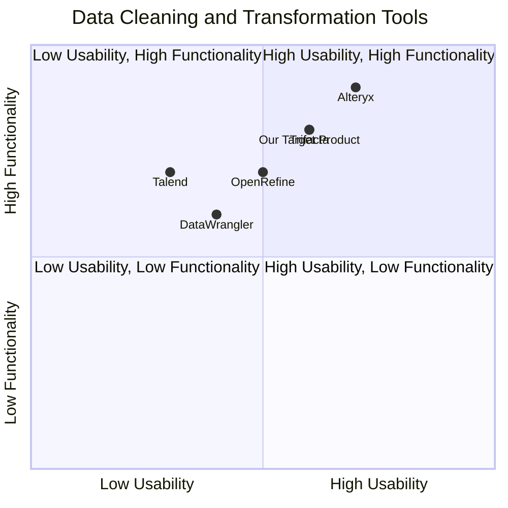

## Original Requirements
The boss wants an R shiny app that can accept two CSV files and perform join or fuzzy join operations on an arbitrary set of columns, in a specified order. The app should be able to perform exact matches on full name or email address, and for rows that didn't match, it should be able to match if the first name is a substring of the name. If that doesn't work, it should be able to fuzzy match the first name and email address or postal address.

## Product Goals
```python
[
    "Create a user-friendly R shiny app that can accept two CSV files",
    "Implement functionality to perform join or fuzzy join operations on an arbitrary set of columns",
    "Incorporate different matching techniques such as exact match, substring match and fuzzy match"
]
```

## User Stories
```python
[
    "As a user, I want to upload two CSV files to the app for data comparison",
    "As a user, I want to perform join operations on any set of columns I choose",
    "As a user, I want to perform fuzzy join operations when exact matches are not found",
    "As a user, I want the app to match rows if the first name is a substring of the name when exact matches are not found",
    "As a user, I want the app to fuzzy match the first name and email address or postal address when other matching techniques fail"
]
```

## Competitive Analysis
```python
[
    "DataWrangler: Offers data cleaning and transformation capabilities but lacks fuzzy matching",
    "OpenRefine: Provides data cleaning and transformation with fuzzy matching but lacks the ability to specify a set order for columns",
    "Trifacta: Allows data cleaning, transformation and fuzzy matching but lacks the ability to perform substring matches",
    "Talend: Offers data cleaning, transformation, and fuzzy matching but lacks a user-friendly interface",
    "Alteryx: Provides a comprehensive suite of data cleaning, transformation, and matching techniques but is expensive for small businesses"
]
```

## Competitive Quadrant Chart


## Requirement Analysis
The product should be a user-friendly R shiny app that can accept two CSV files and perform join or fuzzy join operations on an arbitrary set of columns. The app should be able to perform different matching techniques like exact match, substring match, and fuzzy match.

## Requirement Pool
```python
[
    ("Implement a file upload feature for two CSV files", "P0"),
    ("Create functionality to perform join operations on selected columns", "P0"),
    ("Create functionality to perform fuzzy join operations when exact matches are not found", "P1"),
    ("Implement a substring match feature for first name and name columns", "P1"),
    ("Implement a fuzzy match feature for first name and email address or postal address", "P2")
]
```

## UI Design draft
The app should have a clean and intuitive interface. The main page should have two file upload buttons for the CSV files. Below that, there should be a section where users can select the columns they want to perform join operations on. There should be checkboxes for the different matching techniques. The results should be displayed in a table format below.

## Anything UNCLEAR
There are no unclear points.