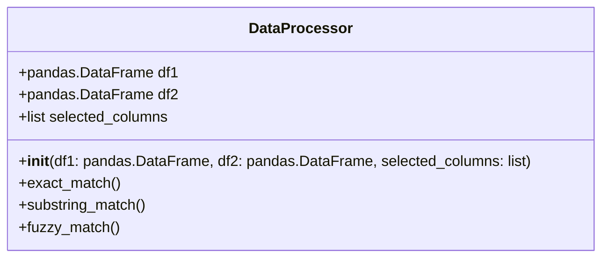
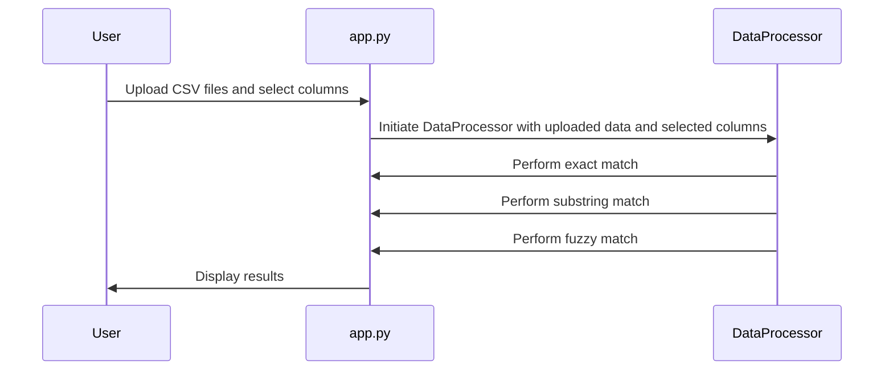

## Implementation approach
We will use Python for this project due to its simplicity and extensive library support. The pandas library will be used for data manipulation and fuzzywuzzy library for fuzzy matching. Flask will be used to create a web application where users can upload CSV files and choose columns for join operations. The results will be displayed using Flask's render_template function.

## Python package name
```python
"data_matching_app"
```

## File list
```python
[
    "app.py",
    "data_processing.py",
    "templates/index.html",
    "templates/result.html",
    "static/styles.css"
]
```

## Data structures and interface definitions


## Program call flow


## Anything UNCLEAR
The requirement is clear to me. However, the performance of fuzzy matching on large datasets might be a concern. We may need to implement some form of pagination or limit the number of rows processed at a time.